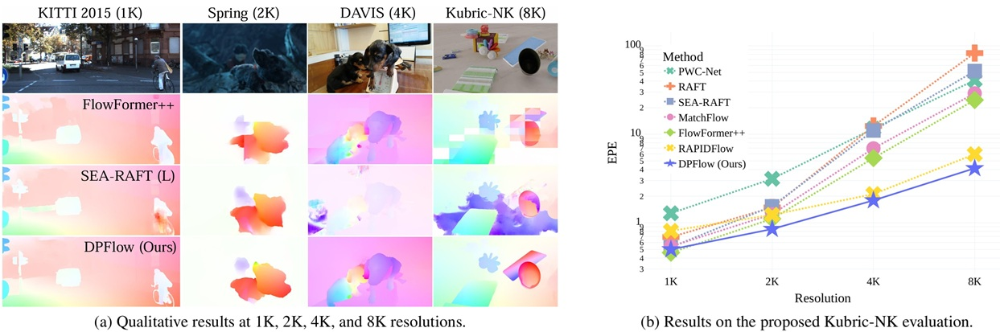

# DPFlow

Source code for the CVPR 2025 paper:

> DPFlow: Adaptive Optical Flow Estimation with a Dual-Pyramid Framework.<br />
> Henrique Morimitsu, Xiaobin Zhu, Roberto M. Cesar Jr, Xiangyang Ji, and Xu-Cheng Yin.

The code and download links for the Kubric-NK dataset are available at [https://github.com/hmorimitsu/kubric-nk](https://github.com/hmorimitsu/kubric-nk).



## Abstract

Optical flow estimation is essential for video processing tasks, such as restoration and action recognition.
The quality of videos is constantly increasing, with current standards reaching 8K resolution.
However, optical flow methods are usually designed for low resolution and do not generalize to large inputs due to their rigid architectures.
They adopt downscaling or input tiling to reduce the input size, causing a loss of details and global information.
There is also a lack of optical flow benchmarks to judge the actual performance of existing methods on high-resolution samples.
Previous works only conducted qualitative high-resolution evaluations on hand-picked samples.
This paper fills this gap in optical flow estimation in two ways.
We propose DPFlow, an adaptive optical flow architecture capable of generalizing up to 8K resolution inputs while trained with only low-resolution samples.
We also introduce Kubric-NK, a new benchmark for evaluating optical flow methods with input resolutions ranging from 1K to 8K.
Our high-resolution evaluation pushes the boundaries of existing methods and reveals new insights about their generalization capabilities.
Extensive experimental results show that DPFlow achieves state-of-the-art results on the MPI-Sintel, KITTI 2015, Spring, and other high-resolution benchmarks.

## Installation

Follow the [PTLFlow installation instructions](https://ptlflow.readthedocs.io/en/latest/starting/installation.html).

This model can be called using the following names: `dpflow`.

The exact versions of the packages we used for our tests are listed in [requirements.txt](requirements.txt).

## Data

Our model uses the following datasets. Download and unpack them according to their respective instructions and then configure the paths in `datasets.yml` (see [PTLFlow installation instructions](https://ptlflow.readthedocs.io/en/latest/starting/installation.html)).

### Training datasets

- [FlyingChairs](https://lmb.informatik.uni-freiburg.de/resources/datasets/FlyingChairs.en.html)
- [FlyingThings3D](https://lmb.informatik.uni-freiburg.de/resources/datasets/SceneFlowDatasets.en.html)
- [MPI-Sintel](http://sintel.is.tue.mpg.de)
- [KITTI 2015](https://www.cvlibs.net/datasets/kitti/eval_scene_flow.php?benchmark=flow)
- [HD1K](http://hci-benchmark.iwr.uni-heidelberg.de/)
- [Spring](https://spring-benchmark.org/)

### Validation/test datasets

- [MPI-Sintel](http://sintel.is.tue.mpg.de)
- [KITTI 2015](https://www.cvlibs.net/datasets/kitti/eval_scene_flow.php?benchmark=flow)
- [Spring](https://spring-benchmark.org/)
- [Middlebury-ST](https://vision.middlebury.edu/stereo/data/scenes2014/)
- [VIPER](https://playing-for-benchmarks.org/)
- [Kubric-NK](https://github.com/hmorimitsu/kubric-nk)

## Training

Follow the [PTLFlow training instructions](https://ptlflow.readthedocs.io/en/latest/starting/training.html).

We train our model in four stages as follows.

### Stage 1: FlyingChairs

```bash
python train.py --config ptlflow/models/dpflow/configs/dpflow-train1-chairs.yaml
```

### Stage 2: FlyingThings3D

```bash
python train.py --config ptlflow/models/dpflow/configs/dpflow-train2-things.yaml
```

### Stage 3: FlyingThings3D+Sintel+KITTI+HD1K
```bash
python train.py --config ptlflow/models/dpflow/configs/dpflow-train3-sintel.yaml
```

### Stage 4a: KITTI 2015
```bash
python train.py --config ptlflow/models/dpflow/configs/dpflow-train4a-kitti.yaml
```

### Stage 4b: Spring
```bash
python train.py --config ptlflow/models/dpflow/configs/dpflow-train4b-spring.yaml
```

## Validation

To validate our model on the training sets of Sintel and KITTI, use the following command at the root folder of PTLFlow:

```bash
python validate.py --config ptlflow/models/dpflow/configs/dpflow-validate.yaml --ckpt things --data.val_dataset sintel-clean+sintel-final+kitti-2015
```

It should generate the following results:

| Dataset      | EPE  | Outlier | px1  | WAUC |
|--------------|------|---------|------|------|
| Sintel clean | 1.02 | 3.16    | 7.85 | 90.0 |
| Sintel final | 2.27 | 6.46    | 13.0 | 85.2 |
| KITTI 2015   | 3.39 | 11.1    | 29.1 | 70.2 |

### Middlebury-ST

```bash
python validate.py --config ptlflow/models/dpflow/configs/dpflow-validate.yaml --ckpt things --data.val_dataset middlebury_st
```

### VIPER

```bash
python validate.py --config ptlflow/models/dpflow/configs/dpflow-validate.yaml --ckpt sintel --data.val_dataset viper
```

### Spring

```bash
python validate.py --config ptlflow/models/dpflow/configs/dpflow-validate.yaml --ckpt sintel --data.val_dataset spring-left
```

### Spring (4k)

```bash
python validate.py --config ptlflow/models/dpflow/configs/dpflow-validate.yaml --ckpt sintel --data.val_dataset spring-left-4k
```

### Kubic-NK

```bash
python validate.py --config ptlflow/models/dpflow/configs/dpflow-validate.yaml --ckpt sintel --data.val_dataset kubric --kubric_root_dir /path/to/kubric-nk/1k
```

To validate on other resolutions, just replace the path in `--kubric_root_dir` to the respective folder containing the data at another resolution.

## Test

The results submitted to the public benchmarks are generated with the respective commands below.

### MPI-Sintel

```bash
python test.py --config ptlflow/models/dpflow/configs/dpflow-test.yaml --ckpt sintel --data.test_dataset sintel
```

### KITTI 2015

```bash
python test.py --config ptlflow/models/dpflow/configs/dpflow-test.yaml --ckpt kitti --data.test_dataset kitti-2015
```

### Spring

```bash
python test.py --config ptlflow/models/dpflow/configs/dpflow-test-spring-zeroshot.yaml
```

```bash
python test.py --config ptlflow/models/dpflow/configs/dpflow-test-spring-finetune.yaml
```

## Code license

The source code is released under the [Apache 2.0 LICENSE](LICENSE).

## Pretrained weights license

Based on the licenses of the datasets used for training the models, our weights are released strictly for academic and research purposes only.

## Citation

If you use this model, please consider citing the paper:

```
@InProceedings{Morimitsu2025DPFlow,
  author    = {Morimitsu, Henrique and Zhu, Xiaobin and Cesar-Jr., Roberto M. and Ji, Xiangyang and Yin, Xu-Cheng},
  booktitle = {The IEEE/CVF Conference on Computer Vision and Pattern Recognition (CVPR)},
  title     = {{DPFlow}: Adaptive Optical Flow Estimation with a Dual-Pyramid Framework},
  year      = {2025},
}
```